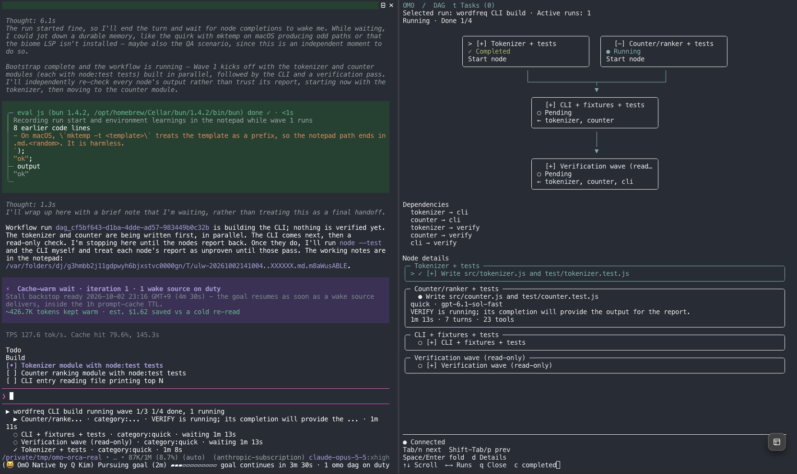

# OmO Orca DAG

**OmO workflow DAG를 Orca 옆 pane에서 실시간으로 확인하세요.**

[English](README.md) | 한국어

`omo-orca-dag`는 [Orca](https://github.com/stablyai/orca)용 [OmO](https://github.com/code-yeongyu/oh-my-openagent) 확장입니다. OmO 세션에서 workflow DAG가 생기면 OmO pane 오른쪽에 split으로 전용 터미널 화면을 엽니다. OmO에서 작업을 이어가면서 의존 관계, 노드 상태, 작업 상세를 함께 볼 수 있습니다.

이 프로젝트는 같은 viewer를 [Herdr](https://herdr.dev/)용으로 제공하는 [jc01rho/omo-herdr-dag](https://github.com/jc01rho/omo-herdr-dag)에서 파생했으며 Orca만 지원합니다. **Herdr를 쓴다면 omo-herdr-dag를 설치하세요.** 두 확장은 함께 설치할 수 있고, 같은 곳에 pane을 여는 일은 없습니다.



*Orca에서 실제로 실행한 `mass ulw` 화면입니다(영어 화면, `--lang ko`로 설치하면 한국어로 표시). 왼쪽 OmO가 작은 단어 빈도 CLI를 만드는 동안, 오른쪽 viewer가 workflow DAG를 보여 줍니다. `Tokenizer + tests`는 끝났고 `Counter/ranker + tests`는 실행 중이며, CLI와 검증 노드는 이 둘을 기다립니다.*

## 목차

- [빠른 시작](#빠른-시작)
- [사전 조건](#사전-조건)
- [설치](#설치)
- [설치 확인](#설치-확인)
- [업데이트](#업데이트)
- [제거](#제거)
- [Orca에서의 동작](#orca에서의-동작)
- [조작 방법](#조작-방법)
- [설정과 로컬 데이터](#설정과-로컬-데이터)
- [문제 해결](#문제-해결)
- [자주 묻는 질문 (FAQ)](#자주-묻는-질문-faq)
- [동작 구조](#동작-구조)
- [개발](#개발)
- [출처와 라이선스](#출처와-라이선스)

## 빠른 시작

Node.js 24 이상과 OmO가 설치되어 있다면 다음 한 줄로 설치합니다.

```bash
npx github:HyunjunJeon/omo-orca-dag install --lang ko
```

Orca의 일반 터미널 pane에서 `omo`를 시작하고(이미 실행 중인 OmO 세션이라면 `/reload`), `/dag-pane`을 입력하세요. 오른쪽에 `OmO DAG`라는 제목의 pane이 열리고 DAG를 기다립니다. 이후 그 세션의 workflow DAG는 모두 자동으로 이 pane에 표시됩니다.

아래에서 각 단계를 자세히 설명합니다.

## 사전 조건

| 구성 요소 | 조건 |
| --- | --- |
| Node.js | 24 이상. OmO가 Bun이나 컴파일된 바이너리로 실행되더라도 viewer는 항상 Node로 실행합니다. `OMO_ORCA_DAG_NODE`를 지정하지 않으면 `PATH`의 `node`를 사용합니다. |
| OmO | `omo.dag.updated` 이벤트를 제공하는 버전. OmO 5.1.9에서 확인했습니다. |
| Orca | Orca 데스크톱 앱이 실행 중이고 `orca` CLI를 쓸 수 있어야 합니다. Orca 터미널은 CLI를 `PATH`에 넣어 줍니다. macOS의 Orca 1.4.218에서 확인했습니다. |
| Git | GitHub이나 clone으로 설치할 때 필요합니다. |
| 터미널 글꼴 | UTF-8과 테두리 문자를 지원해야 합니다. |

OmO를 실행할 Orca 터미널 pane에서 사전 조건을 확인하세요.

```bash
node --version          # v24.0.0 이상
omo --version           # OmO 설치 확인
echo "$TERM_PROGRAM"    # Orca가 출력되어야 합니다
orca --version          # Orca CLI 확인
orca status --json      # Orca 앱이 실행 중이면 "ok": true
```

## 설치

설치 프로그램은 확장 파일을 OmO의 에이전트 디렉터리에 복사합니다. Orca에는 아무것도 설치하지 않으며, 확장 실행에 필요한 npm 의존성도 없습니다.

### 방법 A: GitHub에서 바로 설치

```bash
npx github:HyunjunJeon/omo-orca-dag install --dry-run   # 미리 보기만 하고 아무것도 바꾸지 않습니다
npx github:HyunjunJeon/omo-orca-dag install
```

`npx`가 이 저장소를 캐시에 내려받아 설치 프로그램을 실행하고, 설치 프로그램은 파일을 OmO 에이전트 디렉터리에 복사합니다. 설치된 사본은 npx 캐시와 무관하게 동작합니다.

npm은 기본 Git 인증 정보로 저장소를 받으므로, 그 인증 정보에 이 저장소를 읽을 권한이 있어야 합니다. 기본 키가 아닌 다른 SSH 키로 이 저장소에 접근한다면, 명령을 실행할 때 그 키를 지정하세요.

```bash
GIT_SSH_COMMAND="ssh -i ~/.ssh/<접근-권한이-있는-키> -o IdentitiesOnly=yes" \
  npx github:HyunjunJeon/omo-orca-dag install --lang ko
```

viewer 화면 언어의 기본값은 영어입니다. 설치할 때 언어를 고르면, 이후 설치에서도 다른 값을 주지 않는 한 그 선택을 유지합니다.

```bash
npx github:HyunjunJeon/omo-orca-dag install --lang ko      # 한국어
npx github:HyunjunJeon/omo-orca-dag install --lang zh-cn   # 중국어 간체
npx github:HyunjunJeon/omo-orca-dag install --lang en      # 영어로 되돌리기
```

특정 커밋이나 태그를 설치하려면 저장소 뒤에 붙이세요: `npx github:HyunjunJeon/omo-orca-dag#<커밋-또는-태그> install`.

### 방법 B: clone 후 설치

방법 A로 저장소를 받지 못할 때, 또는 코드를 읽거나 고치거나 테스트를 먼저 돌려 보고 싶을 때 사용합니다.

```bash
git clone git@github.com:HyunjunJeon/omo-orca-dag.git   # 또는 https://github.com/HyunjunJeon/omo-orca-dag.git
cd omo-orca-dag
npm ci --ignore-scripts               # 개발용 테스트 도구만 설치합니다
npm test                              # 선택 사항. macOS와 Linux에서는 Python 3가 필요합니다
node scripts/install.mjs --dry-run    # 미리 보기만 하고 아무것도 바꾸지 않습니다
node scripts/install.mjs --lang ko
```

`node scripts/install.mjs`도 방법 A와 같은 `--lang`, `--agent-dir` 옵션을 받습니다. 설치된 사본은 clone과 독립적이므로, 설치 후 clone을 옮기거나 지워도 됩니다.

### 설치 위치

설치 프로그램은 OmO 에이전트 디렉터리를 `--agent-dir PATH`, `OMO_CODING_AGENT_DIR`, `SENPI_CODING_AGENT_DIR`, `~/.omo/agent` 순서로 정합니다. 기본 디렉터리에 설치하면 다음과 같습니다.

```text
~/.omo/agent/
├── extensions/omo-orca-dag.js      # OmO가 불러오는 진입점
└── orca-dag/
    ├── integration/
    │   ├── current.json            # 현재 설치 세대
    │   └── generation-000001/      # 확장, src/, locale.json, LICENSE
    └── *.json                      # 실행 중 snapshot, pane 기록, 화면 설정
```

`OMO_CODING_AGENT_DIR`은 에이전트 디렉터리 자체를 가리킵니다. 예를 들어 `OMO_CODING_AGENT_DIR=~/.omo`이면 진입점은 `~/.omo/extensions/omo-orca-dag.js`입니다. OmO가 다른 디렉터리에서 확장을 불러온다면 직접 지정하세요.

```bash
npx github:HyunjunJeon/omo-orca-dag install --agent-dir /path/to/agent-directory
```

`--agent-dir`은 설치 위치만 바꿉니다. OmO의 확장 탐색 설정이나 런타임 상태 디렉터리는 바꾸지 않습니다.

설치 프로그램은 JSON 요약을 출력합니다. `--dry-run`은 `"installed": true`만 빠진 같은 계획을 출력합니다. 업데이트할 때는 `backup`에 이전 세대 경로가 함께 나옵니다.

```json
{
  "installed": true,
  "integration": "/Users/you/.omo/agent/orca-dag/integration/generation-000001",
  "extension": "/Users/you/.omo/agent/extensions/omo-orca-dag.js",
  "entry": "omo-orca-dag.js",
  "language": "ko",
  "activation": "새 OmO 세션 또는 /reload"
}
```

### omo-herdr-dag와 함께 설치하기

omo-orca-dag와 omo-herdr-dag는 다음 세 가지가 서로 다르므로 둘 다 설치할 수 있습니다.

| 항목 | omo-orca-dag | omo-herdr-dag |
| --- | --- | --- |
| 진입점 | `omo-orca-dag.js` | `omo-herdr-dag.js` |
| 상태 디렉터리 | `orca-dag/` | `herdr-dag/` |
| 환경 변수 | `OMO_ORCA_DAG_*` | `OMO_HERDR_DAG_*` |

각 확장은 자기 터미널에서만 활성화됩니다. omo-herdr-dag는 Herdr pane에서, omo-orca-dag는 Orca pane에서 동작합니다. Herdr를 Orca 안에서 실행하더라도, Herdr pane 안에서는 omo-orca-dag가 꺼져 있습니다. 두 확장 모두 `/dag-pane`을 제공하지만, 한 세션에서는 둘 중 하나만 활성화됩니다.

### 활성화

확장은 OmO 세션이 시작될 때 로드됩니다. 설치 후에는 Orca 터미널 pane에서 새 OmO 세션을 시작하거나, 이미 실행 중인 OmO 세션에서 `/reload`를 실행하세요.

이미 열려 있는 viewer는 처음 시작할 때의 코드로 계속 동작합니다. 새 버전을 적용하려면 `q`로 닫고 `/dag-pane`으로 다시 여세요.

### 설치하지 않고 써 보기

설치하지 않고 한 세션에서만 checkout을 써 보려면 다음과 같이 실행합니다.

```bash
omo -e /path/to/omo-orca-dag/extension.mjs
```

omo-orca-dag가 설치되어 있지 않을 때만 이렇게 하세요. 불러온 사본마다 pane을 따로 엽니다.

## 설치 확인

1. Orca 터미널 pane에서 `omo`를 시작하고 `/`를 입력하면 명령 목록에 `dag-pane`이 보입니다.

   

   보이지 않으면 [문제 해결](#문제-해결)을 참고하세요.
2. `/dag-pane`을 실행하면 OmO 오른쪽에 `OmO DAG` 제목의 pane이 열리고 `DAG 대기 중`(영어 화면에서는 `Waiting for a DAG`)을 표시합니다. viewer가 시작되면 키보드 포커스는 바로 OmO pane으로 돌아옵니다.
3. viewer 안에서 `q`를 누르면 viewer pane이 닫히고 OmO는 계속 실행됩니다.
4. OmO에 workflow DAG를 실행하는 작업을 맡기면 viewer가 저절로 열리고, 노드가 실행·완료될 때마다 갱신됩니다.

## 업데이트

- 방법 A로 설치했다면: `npx github:HyunjunJeon/omo-orca-dag install`을 다시 실행합니다.
- 방법 B로 설치했다면: clone에서 `git pull` 후 `node scripts/install.mjs`를 실행합니다.

업데이트할 때마다 새 세대 디렉터리를 만들고 이전 세대는 백업으로 남기므로, `/reload`가 캐시된 이전 모듈 대신 새 코드를 불러옵니다. 열려 있는 OmO 세션에서 `/reload`를 실행한 뒤, 열린 viewer를 `q`로 닫고 `/dag-pane`으로 다시 여세요. 언어 설정과 런타임 기록은 그대로 유지됩니다.

## 제거

```bash
rm ~/.omo/agent/extensions/omo-orca-dag.js
rm -rf ~/.omo/agent/orca-dag     # 선택 사항: 설치 세대, snapshot, 화면 설정
```

그다음 `/reload`를 실행하거나 OmO를 다시 시작하고, 남아 있는 DAG pane을 닫으세요. 다른 에이전트 디렉터리에 설치했다면 그 디렉터리의 파일을 지우세요. omo-orca-dag를 제거해도 omo-herdr-dag에는 영향이 없습니다.

## Orca에서의 동작

Orca의 일반 터미널 pane에서 `omo`를 실행하세요. workflow DAG가 생기거나 `/dag-pane`을 실행하면, 확장이 공개 `orca terminal` CLI로 그 pane 오른쪽에 viewer를 split으로 엽니다. Orca에 OmO를 에이전트로 등록할 필요는 없습니다.

다음 조건을 모두 만족할 때만 활성화됩니다. 앞의 세 가지는 Orca가 터미널에 설정합니다.

- `TERM_PROGRAM=Orca`
- `ORCA_TERMINAL_HANDLE` 값이 있음(OmO가 실행 중인 pane)
- `ORCA_WORKTREE_ID` 값이 있음
- Orca CLI를 찾을 수 있음: `ORCA_CLI_COMMAND`가 있으면 그 값, 없으면 `PATH`의 `orca`

tmux 같은 다른 멀티플렉서 안(`TERM_PROGRAM`이 바뀝니다)이나 Herdr pane 안(`HERDR_ENV=1`)에서는 비활성 상태로 남습니다. 비활성 세션에서는 `/dag-pane`을 등록하지 않고, DAG 업데이트를 구독하지 않으며, Orca 명령도 실행하지 않습니다.

Orca CLI의 특성 때문에 몇 가지 동작이 정해집니다. macOS의 Orca 1.4.218에서 확인했습니다.

- **너비:** Orca split에는 비율 옵션이 없어 viewer는 Orca의 기본 split 너비를 씁니다. 경계선을 끌어 크기를 조절하세요.
- **포커스:** Orca split은 키보드 포커스를 새 pane으로 옮깁니다. viewer는 터미널 포커스 보고를 켜고, 첫 포커스 보고를 받으면 `orca terminal focus`로 OmO pane에 포커스를 돌려줍니다. Orca는 pane이 화면에 보일 때만 이 보고를 보내므로, 백그라운드 탭에서 열린 viewer가 사용자를 그 탭으로 끌고 가지 않습니다. 이 경우 나중에 그 탭에 들어갔을 때 viewer에 포커스가 남아 있을 수 있으니 OmO pane을 클릭하세요. viewer가 시작되기 직전 순간에 친 키는 새 pane으로 들어갈 수 있습니다.
- **제목:** `orca terminal rename`은 OmO pane을 포함한 탭 전체의 제목을 바꾸므로, 확장은 탭 제목을 건드리지 않습니다. viewer가 자기 pane 제목을 `OmO DAG`로 설정하며, 남아 있는 viewer도 이 제목으로 찾아 닫습니다.
- **재시작:** Orca terminal handle은 Orca가 한 번 실행되는 동안만 유효합니다. Orca를 재시작하면 기록된 viewer는 닫힌 것으로 보고, 다음 DAG나 `/dag-pane`이 새 viewer를 엽니다.
- **확인하지 않은 환경:** Linux, Windows, SSH로 연결한 Orca 터미널.

## 조작 방법

| 위치 | 명령 또는 키 | 동작 |
| --- | --- | --- |
| OmO | `/dag-pane` | workflow 시작 전에 viewer를 미리 열거나, 닫은 viewer를 다시 엽니다. |
| OmO | `/reload` | 확장을 로드하거나 다시 로드합니다. |
| DAG pane | `↑` / `↓`, `k` / `j` | 스크롤합니다. |
| DAG pane | `Page Up` / `Page Down` | 한 페이지씩 스크롤합니다. |
| DAG pane | `←` / `→` | 여러 실행 사이를 전환합니다. |
| DAG pane | `t` | DAG와 일반 작업 목록을 전환합니다. DAG가 없으면 일반 작업이 기본 화면입니다. |
| DAG pane | `Tab` / `n`, `Shift+Tab` / `p` | 다음·이전 노드를 선택하고 상세 정보로 이동합니다. |
| DAG pane | `Space` / `Enter` | 선택한 노드의 상세 정보와 자식 작업을 접거나 펼칩니다. |
| DAG pane | `d` | 저장된 접기 상태를 바꾸지 않고, 선택한 작업·노드의 전체 상세 보기를 전환합니다. |
| DAG pane | `c` | 실행이 여러 개일 때 완료된 실행을 보이거나 숨깁니다. |
| DAG pane | `q`, `Ctrl+C`, `Ctrl+D` | viewer와 그 pane을 닫습니다. |

`>`는 선택한 노드, `[-]`는 펼친 상태, `[+]`는 접은 상태입니다. 실행 중인 작업은 따로 정하지 않았다면 자동으로 펼쳐지고, 끝나면 접힙니다. 직접 정한 접기·펼치기 상태는 `<snapshot 경로>.view.json`에 저장되어 화면 갱신과 viewer 재시작 후에도 유지됩니다. workflow DAG가 없으면 현재 세션의 일반 subtask 목록을 보여 줍니다.

펼친 작업 카드는 4줄로 간단히 표시합니다. 상태와 설명, 에이전트와 짧은 모델명, 진행 상황 한 줄, 경과 시간과 턴·도구 호출 수입니다. in-process 작업이 모델을 호출하는 동안에는 진행 줄에 그 호출이 살아 있는지 표시합니다. `✎ 방금`(응답), `💭`(thinking), `⚙ write 방금`(도구 인자 생성), `⏳ 응답 대기 12초`, `▶ bash 실행 1분 5초`, `↻ 재시도 2/3` 형태입니다. 30초 동안 새 토큰이 없거나 90초 동안 첫 토큰이 없으면 줄 앞에 `⚠ 멈춤 의심`을 붙이고, 실행 중인 노드를 노란색으로 바꿉니다.

시작할 때, 그리고 viewer 캐시가 비어 있을 때 `/dag-pane`을 실행하면, 현재 세션의 저장된 DAG checkpoint를 `<task 저장소>/dag/runs/`에서 복원합니다. 작업을 다시 실행하지는 않습니다. 다른 세션의 checkpoint는 표시하지 않습니다.

OmO 세션이 끝나도 마지막 그래프는 화면에 남습니다. 한국어 화면에서는 다음과 같이 표시합니다.

```text
○ 연결 종료 · 기록 보존
q를 눌러 닫아도 됩니다.
```

viewer를 닫아도 workflow 작업이 취소되거나 저장된 snapshot이 지워지지 않습니다. 닫아도 된다는 안내가 모든 작업이 성공했다는 뜻은 아닙니다.

## 설정과 로컬 데이터

OmO를 시작하거나 `/reload`를 실행하기 전에 설정하세요.

| 환경 변수 | 기본값 | 용도 |
| --- | --- | --- |
| `OMO_ORCA_DAG_STATE_DIR` | `~/.omo/agent/orca-dag/` | snapshot과 pane 기록의 저장 위치. |
| `OMO_ORCA_DAG_TASK_STATE_DIR` | `<프로젝트>/.omo/senpi-task/` | `tasks/`를 포함하는 OmO task 저장소 경로. OmO의 `task.state_dir`을 바꿨다면 같은 경로로 지정합니다. |
| `OMO_ORCA_DAG_LANG` | 설치 시 저장한 언어, 처음에는 `en` | `en`, `ko`, `zh-cn`으로 화면 언어를 덮어씁니다. |
| `OMO_ORCA_DAG_NODE` | 검증한 호스트 Node, 없으면 `PATH`의 `node` | viewer를 실행할 Node.js 24+ 실행 파일. 공백이 있는 경로도 됩니다. |
| `OMO_ORCA_DAG_RETENTION_DAYS` | `14` | 시작할 때 만료된 snapshot과 pane 기록을 정리하기까지의 일수. 현재 세션의 파일은 항상 남기며, `0`이면 정리하지 않습니다. |
| `ORCA_CLI_COMMAND` | `PATH`의 `orca` | 호출할 Orca CLI. Orca가 관리하는 WSL 세션에서는 Orca가 설정합니다. |

`omob` 같은 독립 실행 빌드도 viewer용 Node.js 24 이상이 따로 필요합니다. 확장은 pane을 열기 전에 런타임을 확인하며, 버전 관리자의 shim도 실제 실행 파일 경로로 바꿔 씁니다. 직접 고르려면 `OMO_ORCA_DAG_NODE=/absolute/path/to/node omo`로 OmO를 시작하세요. 지정한 경로가 잘못되면 다른 런타임으로 조용히 바꾸지 않고 경고합니다.

snapshot은 로컬 JSON 파일입니다. 세션·실행 ID, 노드 이름과 상태, task ID, 의존 관계, 오류 메시지, 작업 설명, 짧은 진행 문구를 저장합니다. workflow 프롬프트, 전체 출력, 최종 응답은 복사하지 않습니다. 그래도 이름과 진행 문구에 프로젝트 정보가 들어갈 수 있으니 런타임 파일을 공개 이슈나 소스 저장소에 올리지 마세요. 확장은 네트워크 서비스나 텔레메트리를 추가하지 않습니다.

## 문제 해결

| 증상 | 확인할 것 |
| --- | --- |
| `/dag-pane`이 없습니다 | 같은 pane에서 `echo "$TERM_PROGRAM $ORCA_TERMINAL_HANDLE $ORCA_WORKTREE_ID"`를 실행해 `Orca`와 ID 두 개가 나오는지 보세요. OmO를 tmux, Herdr 같은 멀티플렉서 안이 아니라 Orca pane에서 바로 실행하세요. `orca status --json`이 `"ok": true`인지 확인한 다음, OmO가 실제로 쓰는 에이전트 디렉터리에 `extensions/omo-orca-dag.js`가 있는지 확인하고 `/reload`를 실행하세요. |
| `npx`가 메시지 없이 종료 코드 128로 끝납니다 | 기본 Git 인증 정보로 저장소를 읽지 못한 경우입니다. [방법 A](#방법-a-github에서-바로-설치)처럼 `GIT_SSH_COMMAND`로 접근 권한이 있는 키를 지정하거나, 방법 B를 사용하세요. |
| viewer에 Node.js 24가 필요하다는 경고가 나옵니다 | Node.js 24 이상을 설치하거나 `OMO_ORCA_DAG_NODE`로 경로를 지정해 OmO를 시작한 뒤 `/dag-pane`을 실행하세요. |
| pane이 자동으로 열리지 않습니다 | viewer는 workflow DAG와 현재 세션의 OmO task가 있을 때 열립니다. OmO task 기록을 만들지 않는 일반 `parallel()` 호출은 표시 대상이 아닙니다. 직접 닫은 pane은 `/dag-pane`을 실행할 때까지 닫혀 있습니다. |
| 닫은 pane이 다시 열리지 않습니다 | 의도한 동작입니다. `/dag-pane`을 실행하세요. |
| viewer에 키보드 포커스가 남아 있습니다 | viewer가 백그라운드 탭에서 열렸을 때 생깁니다. OmO pane을 클릭하세요. |
| 비정상 종료나 재시작 후 `OmO DAG` pane이 남아 있습니다 | 다음 `/dag-pane`이 같은 탭에 남은 viewer를 닫습니다. `q`나 Orca의 닫기 버튼으로 직접 닫아도 됩니다. |
| Linux에서 `orca`가 화면 낭독기를 실행합니다 | GNOME 화면 낭독기도 이름이 `orca`입니다. OmO를 시작하기 전에 `ORCA_CLI_COMMAND`를 Orca CLI(예: `orca-ide` 또는 절대 경로)로 지정하세요. Linux는 확인하지 않았습니다. |
| `DAG pane:` 경고가 나옵니다 | 그 pane에서 `orca terminal list --worktree "id:$ORCA_WORKTREE_ID" --json`이 동작하는지 확인하세요. 실행이 실패하거나 결과가 불확실하면 pane 중복을 막으려고 자동 재시도를 멈춥니다. 반쯤 열린 viewer를 닫은 뒤 `/dag-pane`을 실행하세요. |

## 자주 묻는 질문 (FAQ)

### OmO 확장인가요, Orca 플러그인인가요?

**OmO 확장(extension)**입니다. OmO 안에서 실행되어 workflow 업데이트를 구독하고, Orca의 공개 CLI로 pane을 다룹니다. Orca에는 아무것도 설치하지 않습니다.

### Herdr도 지원하나요?

아니요. Herdr에서는 [omo-herdr-dag](https://github.com/jc01rho/omo-herdr-dag)를 사용하세요. 두 확장은 [omo-herdr-dag와 함께 설치하기](#omo-herdr-dag와-함께-설치하기)에서 설명한 대로 함께 설치할 수 있습니다.

### Orca 밖에서 OmO를 실행하면 어떻게 되나요?

확장은 비활성 상태로 남습니다. `/dag-pane`을 등록하지 않고, DAG 업데이트를 구독하지 않으며, Orca 명령도 실행하지 않습니다. Orca 앱이 열려 있는 것만으로는 부족하고, OmO가 Orca 터미널 pane 안에서 실행되어야 합니다. 활성화 조건의 환경 변수를 직접 설정하지 마세요.

### Orca 자체의 task DAG에 OmO workflow가 보이나요?

아니요. Orca의 orchestration DAG는 Orca가 관리하는 에이전트를 추적합니다. 이 확장은 Orca가 볼 수 없는 OmO 내부 workflow 상태를 보여 줍니다.

## 동작 구조

```text
OmO workflow snapshot: omo.dag.updated
OmO task 진행 정보: omo.task.updated + 로컬 task 기록
시작 시 복구: 현재 세션의 DAG checkpoint
    → Senpi 공유 이벤트 버스: senpi:extension-rpc-event
    → 현재 부모 세션 ID로 필터링
    → 정규화한 로컬 snapshot 저장
    → viewer pane 생성 또는 재사용:
        orca terminal split --terminal <OmO pane> --direction vertical
        orca terminal send --terminal <viewer pane> --text "<viewer 명령>" --enter
    → viewer TUI가 snapshot 파일 변경을 감시
```

`src/orca.mjs`는 확장이 쓰는 `orca terminal` 명령(`split`, `send`, `show`, `list`, `close`, `focus`)을 감쌉니다. snapshot 모델, 화면 렌더링, checkpoint 복구는 omo-herdr-dag에서 가져왔습니다. 일반 subtask는 임의의 의존 노드를 만들지 않고 별도 작업 목록에 표시하며, viewer는 workflow가 선언한 간선만 그립니다.

이 연동은 OmO/Senpi 내부 이벤트 계약에 의존하므로, OmO 버전이 바뀌면 동작이 달라질 수 있습니다.

## 개발

```bash
npm ci --ignore-scripts
npm test               # 가짜 orca CLI를 쓰는 단위 테스트와 실제 PTY 테스트
npm run build          # dist/를 만들고 문법을 검사
npm run test:package   # 패키지를 만들어 임시 프로젝트에 오프라인 설치하고 CLI와 Git 설치 대체 경로를 검증
npm run check          # 위 세 가지를 모두 실행
```

테스트에는 OmO도 Orca도 필요하지 않습니다. POSIX 테스트는 실제 PTY를 위해 Python 3를 쓰고, Windows 테스트는 개발 전용 `node-pty`를 씁니다. GitHub Actions는 Node 24와 26에서 이 검사를 실행합니다. Orca에서의 실기 확인 방법은 [CONTRIBUTING.md](CONTRIBUTING.md), 어디서 무엇을 확인했는지는 [VERIFICATION.md](VERIFICATION.md)에 정리했습니다.

## 출처와 라이선스

[MIT](LICENSE). viewer, snapshot 모델, 설치 프로그램은 jc01rho의 [omo-herdr-dag](https://github.com/jc01rho/omo-herdr-dag)에서 가져왔고, 이 프로젝트는 Orca 연동을 더했습니다. OmO나 Orca의 공식 구성 요소가 아닌 독립 커뮤니티 프로젝트입니다.
